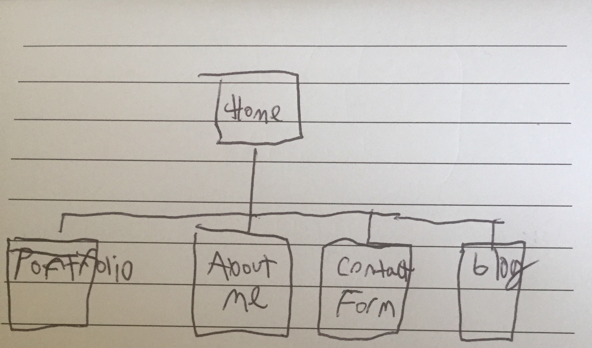

In the reflection file you just created, copy and answer the following questions (or create a video and link to it).

## What are the 6 Phases of Web Design?
Information Gathering, Planning, Design, Development, Testing and Delivery, Maintenance

## What is your site's primary goal or purpose? What kind of content will your site feature?
To sell myself for employment and to spread whatever technical knowledge, opinions, or thoughts through my blog. And to provide a portfolio of my projects.

## What is your target audience's interests and how do you see your site addressing them?
Ideally, my target audience's interest is *me*. But I'm not that egotistical. My target audience is fellow developers and potential employers. I see myself providing technical know-how that helps people, and then links to a contact page.
## What is the primary "action" the user should take when coming to your site? Do you want them to search for information, contact you, or see your portfolio? It's ok to have several actions at once, or different actions for different kinds of visitors.
I'd say look at the portfolio, since that's what's going to be there initially.

## What are the main things someone should know about design and user experience?
Design is about problem solving. Realizing what these problems are and moving forward. And it has to be considered from the very beginning of a project.

## What is user experience design and why is it valuable?
User Experience is how people feel using the product, whatever form it takes. And it's important because people are using it a variety of different ways, through different platforms and with different abilities. You can't just work to please yourself with a website.
## Which parts of the challenge did you find tedious?
I found it difficult to define a website that I could only loosely define the purpose of.

##Site Map:
