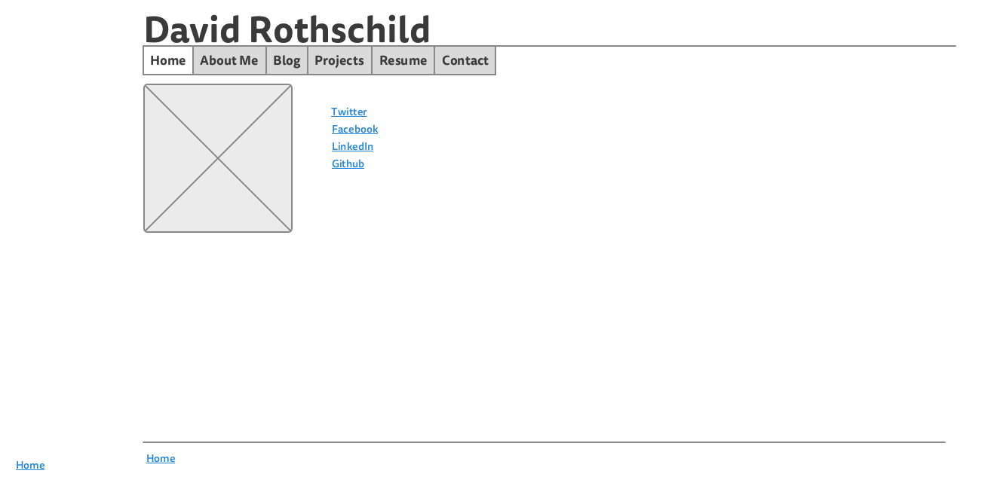
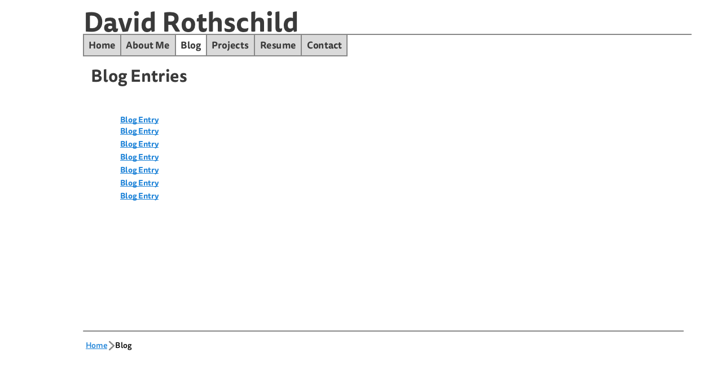

# Wireframe Reflections

## What is a wireframe?
A wireframe is a deliberately simple mockup of a website, a blueprint of the website to come, showing where the content is to go, so that the work of design and coding can be done.
## What are the benefits of wireframing?
Wireframes are important to planning, a step above sketches, allowing you to try various rough design ideas at little cost or time. It also shows if a website (or app) is navigable and understandable to the bare eye. If the concept of site navigation is flawed, it's better found out before coding begins.
## Did you enjoy wireframing your site?
Not at first, and I don't like nor would I reccomend the mockingboard web tool.
## Did you revise your wireframe or stick with your first idea?
I revised as I went along, though the site was basically as I conceived it.
## What questions did you ask during this challenge? What resources did you find to help you answer them?
Mainly my question was what the best tool was to use. I didn't search beyond our initial answers.
## Which parts of the challenge did you enjoy and which parts did you find tedious?
I found aligning the graphical elements tedious, even though I realized I didn't need to do that to an exact standard. I didn't really like any element of it, but I did like having it done. I liked looking up other wireframes, and wirifying existing websites.
