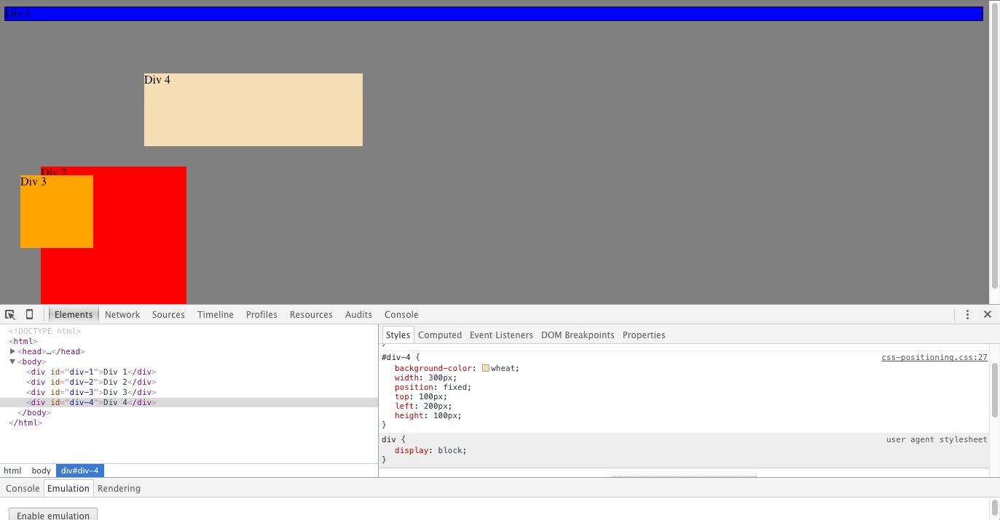
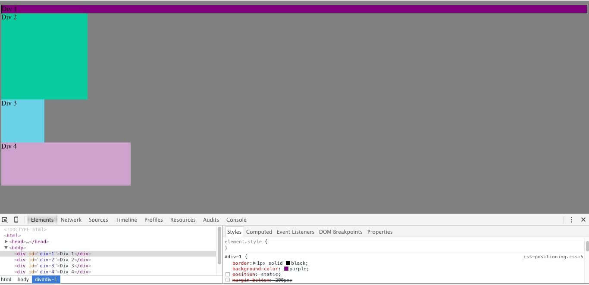
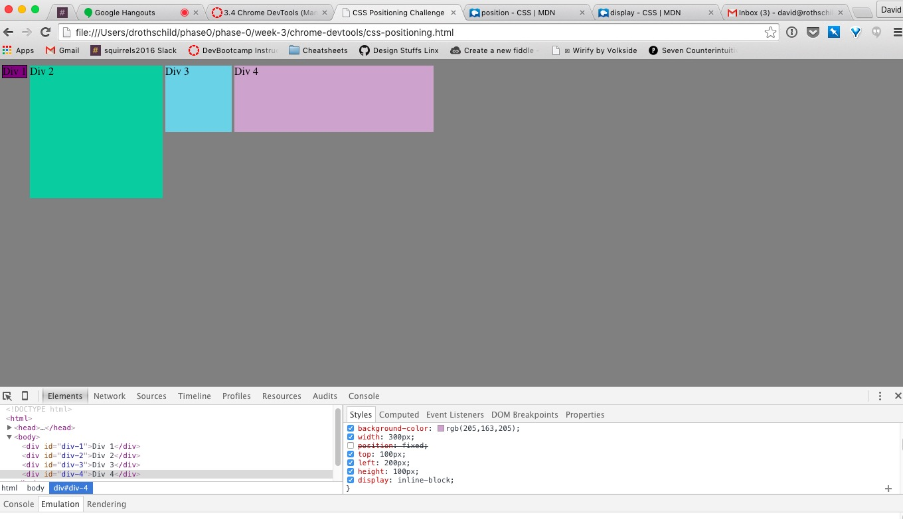
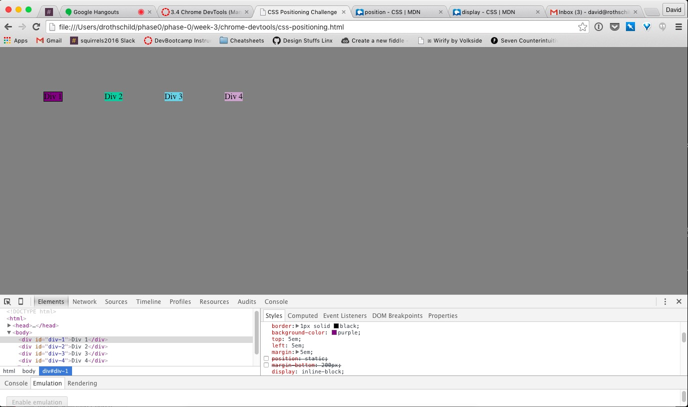
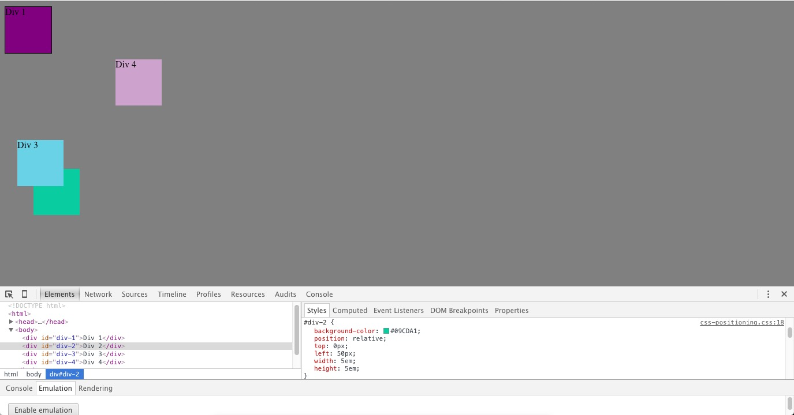

* How can you use Chrome's DevTools inspector to help you format or position elements?

> You can alter any of the elements of CSS and see the changes instantly on the screen. Change the colors by using "background-color".Format the text(which we didn't do for this exercise) using any text tag, change the margins, the positions, the left and top offsets. You could change the display, the margins.

* How can you resize elements on the DOM using CSS?

> Using either "height" and "width" tags, or display. In addition padding changes the size of the object.

* What are the differences between absolute, fixed, static, and relative positioning? Which did you find easiest to use? Which was most difficult?

> Absolute: An element positioned in relation to its nearest positioned ancestor (which didn't come up in this exercise), or the container.
Fixed: The easiest to work with. Positioned at a specific position relative to the screen. It stays still while the window is scrolled.
Relative: The one that drove us nuts. It's not positioned relative to other elements on the screen, instead it's relative to where it would normally be placed. The rest of the elements display as if the item was in its original space.
static: The default. Position the item as it would be normally. All the properties (top, right, left, bottom), do nothing.

* What are the differences between margin, border, and padding?

> Margin is blank space, outside the item, keeping other items from coming near it, like a shield. Border is the lines around the item. Padding is between the item and its content. It's the color of the background color of the item.

* What was your impression of this challenge overall? (love, hate, and why?)

> Frustrating as hell to deal with, but ultimately rewarding. Nothing worked the way it seemed it should work, and I still don't really get positioning, but I felt very good when we finished. I wish we'd saved the CSS files, and not just the screenshots for reference.