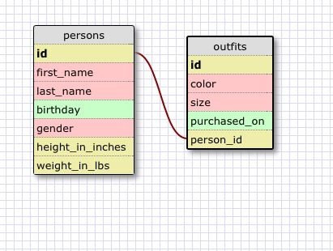

Release 5

1. SELECT * FROM States;
2. SELECT * FROM Regions;
3. SELECT state_name, population FROM States;
4. SELECT state_name, population FROM States ORDER BY population DESC;
5. SELECT state_name FROM States WHERE region_id = 7;
6. SELECT state_name, population_density FROM states WHERE population_density >50 ORDER BY population_density ASC;
7. SELECT state_name FROM States WHERE population BETWEEN 1000000 AND 1500000;
8. SELECT state_name, region_id FROM States ORDER BY region_id ASC;
9.SELECT region_name FROM Regions WHERE region_name LIKE '%Central%';
10. SELECT Regions.region_name, States.state_name FROM States
    INNER JOIN Regions ON States.region_id = Regions.id
    ORDER BY regions.id ASC;

Release 6

 What are databases for?

Databases are for storing information, in an organized, fashion

What is a one-to-many relationship?

The most common form of database relationship. One primary record relates to many children records. As for example each region in the regions table has many states related to it.

What is a primary key? What is a foreign key? How can you determine which is which?

A primary key is a non-repeating number, generally an integer, used to distinguish one record in a database from all the others. The foreign key is used to refer to it. If the database is designed with any common sense, the primary key is the first record and it is called 'id'. The foreign key should be reference the name of the table its connected to.

How can you select information out of a SQL database? What are some general guidelines for that?

Using SELECT queries. A good general guideline is to use WHERE in order to limit the query and use ORDER BY to sort the results.