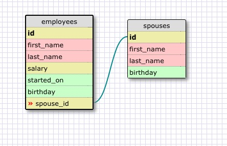
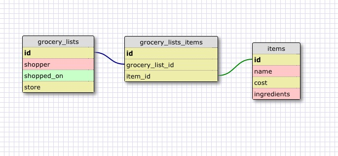

### Release 2

### Release 4

What is a one-to-one database?

Where there is a relationship of one foreign key to one primary key. so that the two records go together, but not with any other records.

When would you use a one-to-one database? (Think generally, not in terms of the example you created).

Two scenarios:
1. Where a group of related field can frequently be empty.
2. When there are fields that you need but rarely pull up and would like to not to tax your queries by selecting them.

What is a many-to-many database?

Where there is a join table joining two one-to-many relationships.

When would you use a many-to-many database? (Think generally, not in terms of the example you created).

When both tables could have one or more records related to the other.

What is confusing about database schemas? What makes sense?

I understand this pretty well.